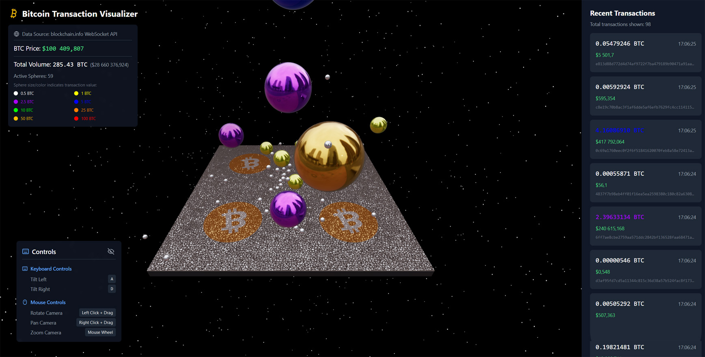

# 3D Bitcoin Transaction Visualizer

A real-time 3D visualization tool for Bitcoin transactions using Three.js and React. This application creates an immersive experience by representing Bitcoin transactions as dynamic spheres in a 3D space.



## Features

- 🌐 Real-time transaction monitoring through blockchain.info WebSocket API
- 💰 Live Bitcoin price updates from CoinDesk API
- 🎨 Dynamic sphere colors and sizes based on transaction amounts
- 📊 Transaction history with detailed information
- 🎥 3D visualization with physics simulation
- ⚡ Built with modern React and Three.js
- 🚀 GPU-optimized rendering with high-performance mode for systems with multiple GPUs

- Real-time visualization of Bitcoin transactions
- Dynamic 3D spheres representing transactions with:
  - Size based on transaction amount
  - Color coding based on transaction value
  - Physical interactions between transaction spheres
  - Reflective surfaces with Bitcoin logo texture
- Interactive ground plane with:
  - Custom concrete texture
  - Centered Bitcoin logo overlay
  - Dynamic tilting based on user input
- Transaction details modal on sphere click
- Physics-based animations using Rapier physics engine
- Responsive 3D environment with proper lighting and shadows

## Performance Optimization

The application is optimized to utilize your GPU's capabilities:
- Uses WebGL for hardware-accelerated graphics rendering
- Automatically requests high-performance GPU on systems with multiple graphics cards
- Optimized rendering settings with antialiasing and disabled unnecessary alpha channel
- Efficient 3D scene management with Three.js

## Color Coding

Transaction spheres are color-coded based on their BTC amount:
- White: 0.5 BTC
- Yellow: 1 BTC
- Purple: 2.5 BTC
- Blue: 5 BTC
- Green: 10 BTC
- Orange: 25 BTC
- Gold: 50 BTC
- Red: 100 BTC

## Technologies Used

- React
- TypeScript
- Three.js for 3D rendering
- @react-three/fiber for React integration with Three.js
- @react-three/rapier for physics simulation
- WebGL for hardware-accelerated graphics
- Vite for development and building

## Installation

1. Clone the repository:
```bash
git clone https://github.com/yourusername/3d-bitcoin-transaction-visualiser.git
cd 3d-bitcoin-transaction-visualiser
```

2. Install dependencies:
```bash
npm install
```

3. Create a `.env` file in the root directory and add your Bitcoin API credentials if required:
```env
VITE_API_KEY=your_api_key_here
```

4. Start the development server:
```bash
npm run dev
```

5. Open your browser and navigate to:
```
http://localhost:5173
```

## Usage

- The application will automatically start displaying Bitcoin transactions as they occur
- Spheres will fall onto the ground plane and interact with each other
- Click on any sphere to view detailed transaction information
- Use keyboard controls to interact with the ground plane:
  - Arrow keys to tilt the ground
  - Ground will automatically return to level position when keys are released

## Project Structure

```
src/
├── components/          # React components
├── hooks/              # Custom React hooks
├── utils/              # Utility functions
├── types/              # TypeScript type definitions
└── assets/            # Static assets and textures
```

## Configuration

The application can be configured through various configuration files:

- `src/config/constants.ts` - General application constants
- `src/utils/sphereUtils.ts` - Sphere size and physics calculations
- `src/utils/colorUtils.ts` - Color mapping for transactions
- `src/utils/groundUtils.ts` - Ground plane behavior and textures

## Development

To start development:

1. Fork the repository
2. Create a new branch for your feature
3. Make your changes
4. Submit a pull request

## Building for Production

To create a production build:

```bash
npm run build
```

The built files will be in the `dist` directory.

## License

[MIT License](LICENSE)

## Contributing

Contributions are welcome! Please feel free to submit a Pull Request.
